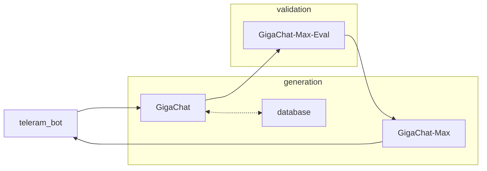

В ветке master лежит музейный гид по виртуальному выставочному фонду at the ОЦ «Сириус», готовый для деплоя. 
Для запсука требуется установить docker. Команда для запуска проекта: docker compose up --build -d 

# ИИ-гид

## Scheme

